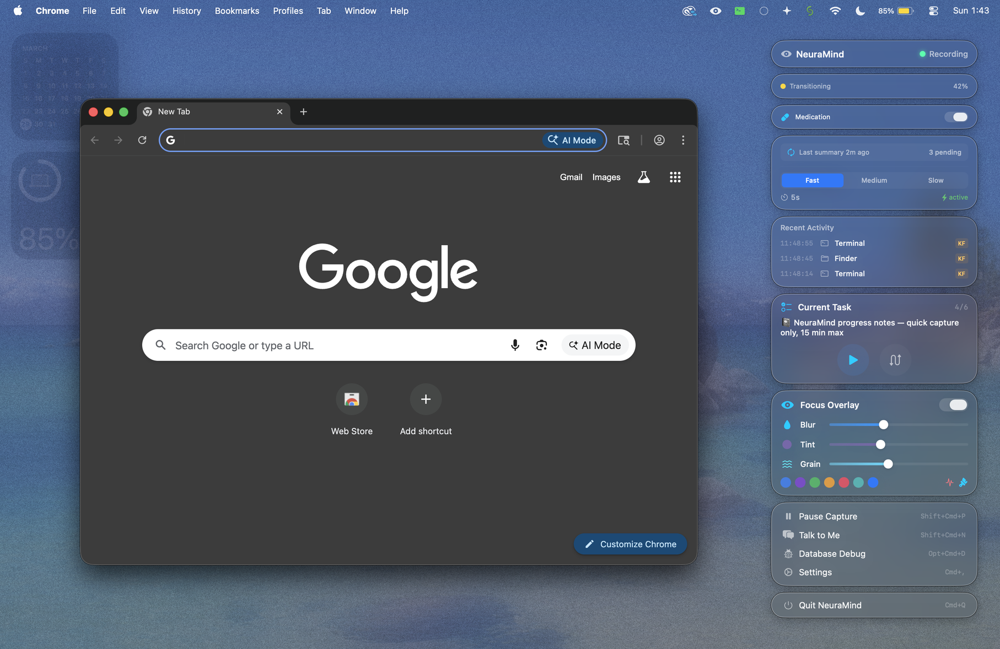

# NeuraMind

The average person with ADHD loses hours to context-switching and executive dysfunction. **NeuraMind** is a macOS ambient memory engine that captures, connects, and resurfaces your work context so you never lose your train of thought again.

This project was built as part of the Claude Builder Club Hackathon @ IU on March 29, 2026.

Demo Video: https://youtu.be/z3_eFS4P9w8



## What NeuraMind Does

NeuraMind is an intelligent context manager for macOS that:
- **Captures your work context** via screen recording and accessibility data
- **Understands what you're doing** with Claude AI analysis
- **Resurfaces relevant context** when you switch tasks or lose focus
- **Keeps you in flow** by preventing context-switching tax

Perfect for anyone with ADHD, executive dysfunction, or anyone who juggles multiple projects.

## Features

### Focus & Context Recovery
- **Real-Time Focus State Detection** - Monitors your focus level every 10 seconds using app-switching patterns and session depth
- **Color-Coded Focus Overlay** - Screen border changes color based on focus state (green=focused, amber=transitioning, orange=drifting, red=active drift, purple=hyperfocus)
- **Context Recovery Cards** - Automatically shows what you were working on when you regain focus after drifting

### Planning & Reflection
- **Morning Planning** - Set daily goals and generate an AI-powered prioritized plan with email context
- **Wind Down Recap** - End-of-day summary comparing your actual activity against morning goals
- **Time Tracking** - Manual task timer for projects that need explicit time tracking

### Context & Memory
- **Medication Logging** - Track when you take ADHD medication to correlate with focus patterns
- **Semantic Search** - Find relevant past work context from your history using AI-powered search
- **AI Conversation** - Chat with Claude about your work context and get personalized insights
- **Automatic Activity Summaries** - Captures your screen, detects app changes, and generates AI summaries every 5 minutes
- **Local Privacy-First Storage** - All data stays on your Mac in an encrypted SQLite database unless you explicitly enable Claude features

## System Requirements

- macOS 14 (Sonoma) or later
- Apple Silicon Mac (M1 or newer)
- **Claude Code (required)** — [Download here](https://claude.com/claude-code)
- Screen Recording permission
- Accessibility permission

## Installation

### From Homebrew

```bash
brew tap dsatyam09/neuramind
brew install --cask neuramind
```

### From Source

```bash
git clone https://github.com/dsatyam09/NeuraMind.git
cd NeuraMind
make bundle
open .build/NeuraMind.app
```

## Privacy & Data Security

**NeuraMind does not collect data itself.** All your screen recordings and accessibility data stay on your Mac. However, if you use Claude AI features, **data sharing depends on your Claude account settings**.

### Local Storage
- Screen recordings and accessibility data are stored locally in `~/Library/Application Support/NeuraMind/`
- All processing happens on your device
- NeuraMind does not collect analytics or telemetry

### Claude AI Features
When you enable Claude-powered features, NeuraMind uses your **local Claude CLI** (your existing Claude subscription):
- Context summaries are sent to Claude for analysis via your authenticated Claude CLI
- **Important**: If you have not opted out of data sharing in your Claude account settings, Anthropic may use this data for model improvement
- To control this, check your Claude account privacy settings at [claude.ai](https://claude.ai) (see Account → Data & Privacy)

### What You Can Control
- **Disable Claude features**: Keep everything local and prevent any external API calls
- **Manage Claude's data settings**: Review your Anthropic account data sharing preferences
- **Delete local data anytime**: Remove stored context from your Mac

### Required Permissions
- **Screen Recording**: Captures browser and app context to understand your work
- **Accessibility**: Reads window titles, application names, and text selection to build memory
- **Storage**: Stores data locally in SQLite database

## Team

Built by:
- [Anooshka Bajaj](https://github.com/ab490)
- [Satyam Dubey](https://github.com/dsatyam09)
- [Saai Vignesh Premanand](https://github.com/saaivignesh20)
- [Humaid Ilyas](https://github.com/humaidilyas)

## Roadmap

**Upcoming Features:**
- [ ] **OpenRouter API Support** - Extend model access to support multiple LLM providers (GPT-4, Claude, Llama, etc.) through OpenRouter, giving users flexibility to choose their preferred models and providers
- [ ] **Windows Native Support** - Bring NeuraMind to Windows with native context capture and ambient memory features

## Contributing

Contributions welcome! Please open an issue or pull request on [GitHub](https://github.com/dsatyam09/NeuraMind).
